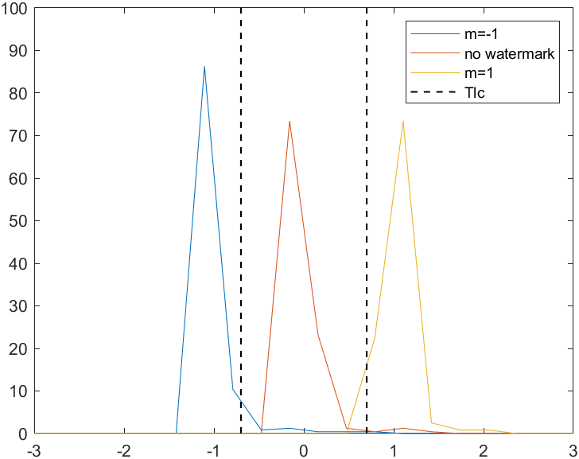
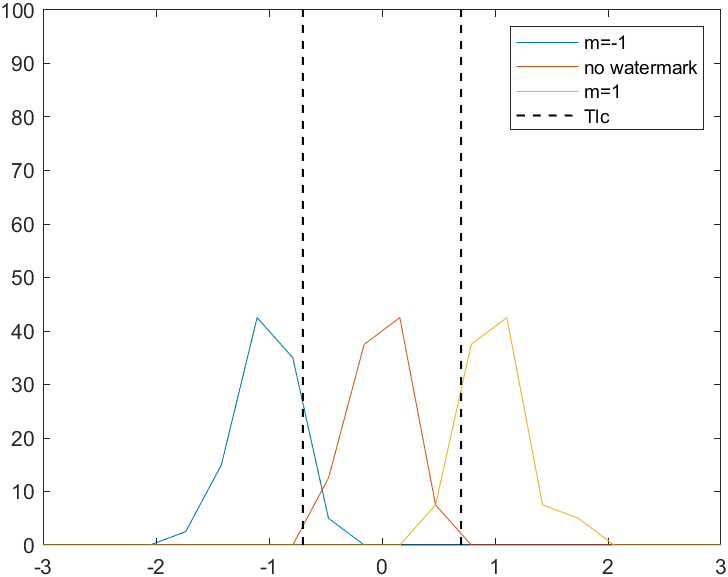
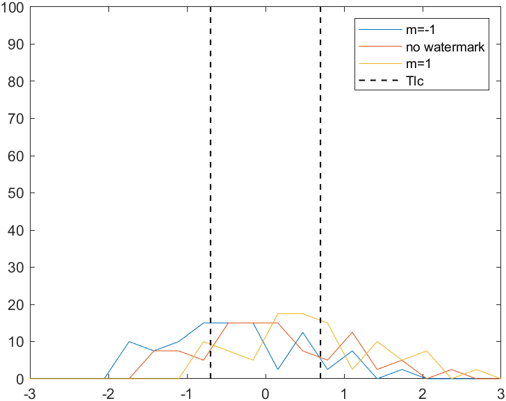
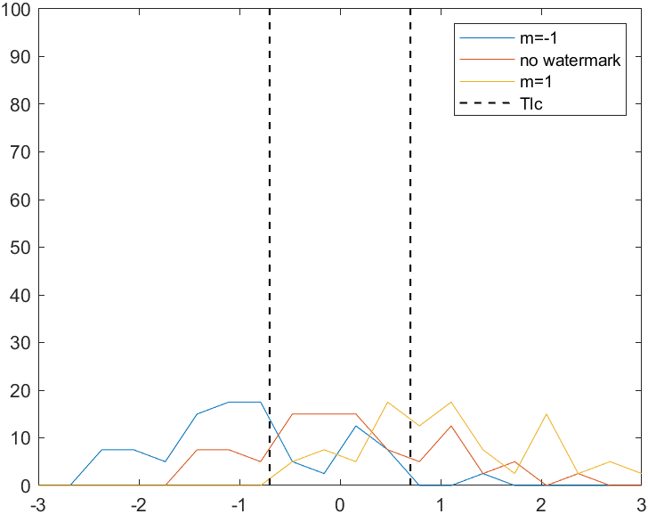

## 实验一：E_BLIND/D_LC 系统测试
### 一、实验目的
1. 了解 E_BLIND/D_LC 系统的基本原理，理解 False Positive 和 False Negative 的概念，掌握Linear Correlation 的计算。
2. 考察 E_BLIND/D_LC 系统检测值的分布，给出检测值的概率分布图或密度分布图。
3. 测试 8-bit 灰度值截断对系统检测准确率的影响。
### 二、实验内容与要求
1. 实现 E_BLIND/D_LC 系统。
2. 设计一张水印，嵌入强度 α = 1，使用该水印测试 E_BLIND/D_LC 系统应用于不同封面时的检测准确率，计算 False Positive/Negative Rate，并绘制如课本图 3.6 的检测值分布图或密度图。要求封面数量不少于 40 张(建议使用课程提供的标准数据集作为测试封面)。
3. 设计不少于 40 张不同的水印, 使用固定的嵌入强度 α = 1，选择一张黑白像素比例(即灰度值接近0 或 255 的像素数量占总像素数量的比例) 不高于 30% 的封面，测试不同的水印嵌入同一封面时E_BLIND/D_LC 系统的检测准确率，计算 False Positive/Negative Rate，并绘制如课本图 3.6的检测值分布图或密度图。
4. 选取一张黑白像素比例不低于 50% 的原始封面，重复子实验 3，比较检测准确率并分析原因。

### 三、实验环境
Win11 MATLAB R2024b
### 四、实验过程
#### 1 实现E_BLIND和D_LC系统
E_BLIND系统：

通过message值判断需要加还是减去相应的水印像素值。

```
function [res] = E_blind(image, pattern, m, alpha)
% image -- 原始图像
% pattern -- 水印模板
% m -- 待嵌入消息位
% alpha -- 水印嵌入强度

res = image;
[width, height] = size(image);
pattern = (m * alpha) * pattern;
for i = 1:width
  for j = 1:height
    res(i,j) = res(i,j) + pattern(i,j);
  end
end
```

D_LC系统：
通过计算水印和图像的相关性，与阈值的比较来判断是否添加了水印。

```
function relation = D_LC(image, pattern)
% image -- 待检测图像
% pattern -- 参考水印模板

[width, height] = size(image);
sum = 0.0;
for i = 1:width
    for j = 1:height
        sum = sum + double(image(i,j)) * pattern(i,j);
    end
end
relation = sum / (width*height);
```

#### 2 同一水印不同封面

先通过`generate.m`随机生成相应水印，读取水印。

```
predict = [];
predict_flag = [];
answer = [];
filename = dir('data');
filename = filename(3:end);
filenum = size(filename);
Tlc = 0.6;
pattern = load('task1_data/data1.mat');
pattern = pattern.pattern;
```

再进行循环得到message=-1,0,1时的预测值和真实值，并存储在向量里。

```
for i = 1:filenum
  for j = -1:1
    image = imread(['data/' filename(i).name]);
    if j ~= 0
      image = E_blind(image, pattern, j, 1);
    end
    k = i*3+j-1;
    answer(k) = j;
    predict(k) = D_LC(image, pattern);
    if predict(k) > Tlc
      predict_flag(k) = 1;
    elseif predict(k) < -Tlc
      predict_flag(k) = -1;
    else
      predict_flag(k) = 0;
    end
  end
end
```

再通过`false_pn`函数进行计算精准度，假阳性率和假阴性率。

```
[accu, false_pos, false_neg] = False_pn(answer, predict_flag);
fprintf('accuracy = %.2f%%\n', accu*100);
fprintf('false positive = %.2f%%\n', false_pos*100);
fprintf('false negative = %.2f%%\n', false_neg*100);
```

#### 3 不同水印同一封面（黑白像素比例不大于30%）

我选择了`peppers.bmp`作为封面，黑白像素比例接近0%。

```
size(imread('data/peppers.bmp'))
```

可得到图片大小为$512\times 512$，所以生成40个$512\times512$的水印。

后面和同一水印不同封面的基本类似，只是将封面循环改为了水印循环。

#### 4 不同水印同一封面（黑白像素比例不小于50%）

我选择了`rec.bmp`作为封面，黑白像素比例接近100%。

```
size(imread('data/rec.bmp'))
```

可得到图片大小为$256\times 256$，所以生成40个$256\times256$的水印。

后面和黑白像素比例不大于30%的相同。

#### 5 8-bit 灰度截断

由于图像添加了水印后，图像的像素点值超过了255或者小于0时，发生了8-bit 灰度值截断，之前实现的水印检测系统，控制图像增加水印后像素分布值在$[0,255]$之间，即发生了8-bit 灰度值截断。通过之前实验的数据观察，对于黑白像素比例较大的封面，出现灰度截断会严重影响准确率，所以在考虑8-bit灰度截断的情况下，重新对不同水印同一封面（黑白像素比例不小于50%）进行检测，和之前不同的是，在读入封面后，通过`image=int16(image)`对封面的像素点类型进行扩充，从而在水印覆盖时不出现数据溢出，提高检测的准确率。

### 五、实验分析与结论
#### 1 不同封面
使用水印测试 E_BLIND/D_LC 系统应用于不同封面


```
accuracy = 98.34%
false positive = 0.83%
false negative = 0.83%
```

#### 2 不同水印（黑白像素比例不高于30%）
使用不同水印测试 E_BLIND/D_LC 系统应用于同一封面（黑白像素比例不高于30%）


```
accuracy = 95.00%
false positive = 0.83%
false negative = 4.17%
```

#### 3 不同水印（黑白像素比例不低于50%）
使用不同水印测试 E_BLIND/D_LC 系统应用于同一封面（黑白像素比例不低于50%）

```
accuracy = 48.33%
false positive = 24.17%
false negative = 27.50%
```

#### 4 8-bit灰度截断
在避免了8-bit灰度截断情况下，使用不同水印测试 E_BLIND/D_LC 系统应用于同一封面（黑白像素比例不低于50%）



```
accuracy = 62.50%
false positive = 16.67%
false negative = 20.83%
```
### 六、实验感想

通过本次实验，我对E_BLIND/D_LC有了初步认识，对水印的检测也有了一定的理解。