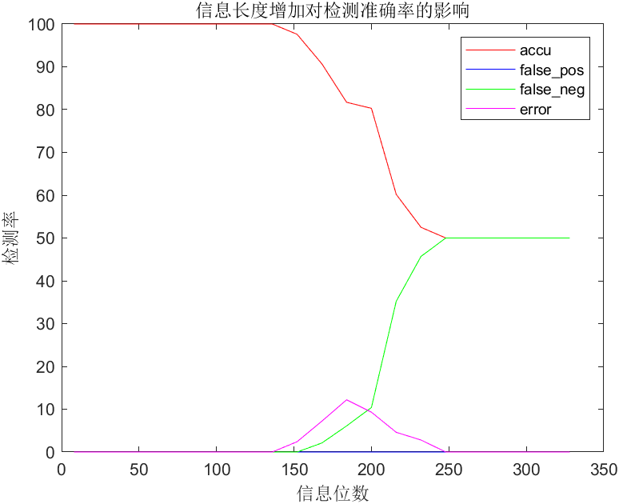

## 实验二：E_SIMPLE_8/D_SIMPLE_8 系统测试

### 一、实验目的

1. 理解 E_SIMPLE_8/D_SIMPLE_8 系统的基本原理，掌握简单的多位信息水印技术

### 二、实验内容与要求

1. 实现 E_SIMPLE_8/D_SIMPLE_8 系统
2. 设计一张水印，嵌入强度 α = 8​，使用该水印测试 E_SIMPLE_8/ D_SIMPLE_8 系统应用于不同封面时的检测准确率，计算 False Positive/Negative Rate 和解码的准确率。要求封面数量不少于 40 张。False Positive/Negative Rate 的计算可以采取不同的原则。其中一种可以使用的原则是，预先设定一个固定的阈值，8 个检测值（detect value）中有 4 个超过了阈值，就认为存在水印，否则认为不存在水印。（也可以使用其他合理的原则，需要在报告中说明使用的是哪种原则）。准确率的计算，则是对确实添加了水印的图片，计算解码出来的信息的错误率。
3. 设计不少于 40 张不同的水印, 使用固定的嵌入强度 _α_ = 8，测试 E_SIMPLE_8/ D_SIMPLE_8 系统应用于同一封面时的检测准确率，计算 False Positive/Negative Rate
4. 分析信息长度增加对检测准确率的影响

### 三、实验环境
Win11 MATLAB R2024b

### 四、实验过程

##### 1 实现E_SIMPLE_8和D_SIMPLE_8系统
E_SIMPLE_8系统根据twister随机数生成8个随机水印，根据提供的水印序列信息合并为一个水印。考虑到lab1中灰度截断对实验结果的影响，将大于255和小于0的像素均进行了最终处理。

```matlab
function image = E_SIMPLE(cover, watermark, basic_seed, alpha)
	% cover       - 待加入水印的图像
	% watermask   - 水印序列
	% basic_seed  - 随机种子基数
	% alpha       - 水印强度

	watermark_matrix = zeros(size(cover));
	[rows, cols] = size(cover);
	len = length(watermark);
	total_pixels = rows * cols;

	if len > total_pixels
		error('Watermark len exceeds number of pixels in the cover image.');
	end

	for i = 1:len
		rng(basic_seed+i, 'twister');
		pattern = randn(size(cover));

		for j = 1:rows
			for k = 1:cols
				if watermark(i) == 1
					watermark_matrix(j,k) = watermark_matrix(j,k) + pattern(j,k);
				else
					watermark_matrix(j,k) = watermark_matrix(j,k) - pattern(j,k);
				end
			end
		end
	end
	
	watermark_matrix = watermark_matrix - mean(mean(watermark_matrix));
	watermark_matrix = watermark_matrix/std2(watermark_matrix);

	image = im2double(cover) + alpha * watermark_matrix;

	for i = 1:rows
		for j = 1:cols
			if image(i,j)>255
				image(i,j)=255;
			elseif image(i,j)<0
				image(i,j)=0;
			end
		end
	end
end
```

D_SIMPLE_8系统计算出图像和八个水印的相关程度，如果大于阈值，则认为有相关性，如果有四个或以上的水印与此图像有相关性，则认为添加了水印。

```
function [mark, noexist_cnt] = D_SIMPLE(marked_image, basic_seed, len)
	% marked_image - 含有水印的灰度图像
	% basic_seed   - 随机种子基数
	% len          - 水印的长度

	threshold = 0.01;
	noexist_cnt = 0;
	image_double = im2double(marked_image);
	mark = zeros(1, len);
	[rows, cols] = size(marked_image);
	
	for i = 1:len
		rng(basic_seed+i, 'twister');
		pattern = randn(size(marked_image));
		corr_val = mean(mean(image_double .* pattern(1:rows,1:cols)));
		
		if corr_val > threshold
			mark(i) = 1;
		elseif corr_val < -threshold
			mark(i) = 0;
		else
			mark(i) = -1;
			noexist_cnt = noexist_cnt + 1;
		end
	end
end
```

##### 2 应用于不同封面的水印检测系统

对于实验数据集的241张图片以及用E_SIMPLE_8添加了水印的图片进行检测。

```
filename = dir('data');
filename = filename(3:end);
filenum = length(filename);

watermask = randi([0,1], [1,8]);
alpha = sqrt(8);
seed = 0;
corr_cnt = 0;
fal_pos_cnt = 0;
fal_neg_cnt = 0;
err_cnt = 0;

for i = 1:filenum
	path = filename(i).name;
	cover = imread(['data/' path]);
	
	image = E_SIMPLE(cover, watermask, seed, alpha);
	[masked_predict, noexist_cnt] = D_SIMPLE(image, seed, 8);
	if masked_predict == watermask
		corr_cnt = corr_cnt + 1;
	elseif noexist_cnt >= 4
		fal_neg_cnt = fal_neg_cnt + 1;
	else
		err_cnt = err_cnt + 1;
	end
	
	[unmasked_predict, exist_cnt] = D_SIMPLE(cover, seed, 8);
	if exist_cnt >= 4
		corr_cnt = corr_cnt + 1;
	else
		fal_pos_cnt = fal_pos_cnt + 1;
	end
end

total_cnt = corr_cnt + fal_pos_cnt + fal_neg_cnt + err_cnt;

fprintf('总测试数: %d\n', total_cnt);
fprintf('正确检测率: %.2f%%\n', (corr_cnt/total_cnt) * 100);
fprintf('误检率 (False Positive Rate): %.2f%%\n', (fal_pos_cnt / total_cnt) * 100);
fprintf('漏检率 (False Negative Rate): %.2f%%\n', (fal_neg_cnt / total_cnt) * 100);
fprintf('错误检测率: %.2f%%\n', (err_cnt/total_cnt) * 100);
```

##### 3 应用于不同水印的水印检测系统

通过改变随机数的基数来生成不同的水印，并选取`data/pepples.bmp`来进行检测。

```
cover = imread('data/peppers.bmp');
alpha = sqrt(8);
corr_cnt = 0;
fal_pos_cnt = 0;
fal_neg_cnt = 0;
err_cnt = 0;

for i = 1:40
	seed = i;
	watermask = randi([0,1], [1,8]);
	
	image = E_SIMPLE(cover, watermask, seed, alpha);
	[masked_predict, noexist_cnt] = D_SIMPLE(image, seed, 8);
	if masked_predict == watermask
		corr_cnt = corr_cnt + 1;
	elseif noexist_cnt >= 4
		fal_neg_cnt = fal_neg_cnt + 1;
	else
		err_cnt = err_cnt + 1;
	end

	[unmasked_predict, exist_cnt] = D_SIMPLE(cover, seed, 8);
	if exist_cnt >= 4
		corr_cnt = corr_cnt + 1;
	else
		fal_pos_cnt = fal_pos_cnt + 1;
	end
end

total_cnt = corr_cnt + fal_pos_cnt + fal_neg_cnt + err_cnt;

fprintf('总测试数: %d\n', total_cnt);
fprintf('正确检测率: %.2f%%\n', (corr_cnt/total_cnt) * 100);
fprintf('误检率 (False Positive Rate): %.2f%%\n', (fal_pos_cnt / total_cnt) * 100);
fprintf('漏检率 (False Negative Rate): %.2f%%\n', (fal_neg_cnt / total_cnt) * 100);
fprintf('错误检测率: %.2f%%\n', (err_cnt/total_cnt) * 100);
```

##### 4 信息长度对检测准确率的影响

通过多个递增的信息长度进行分析，得到其检测准确率的直观表示。

### 五、实验结果与分析
##### 1 应用于不同封面的水印检测系统
```
总测试数: 482
正确检测率: 100.00%
误检率 (False Positive Rate): 0.00%
漏检率 (False Negative Rate): 0.00%
错误检测率: 0.00%
```

##### 2 应用于不同水印的水印检测系统

```
总测试数: 80
正确检测率: 100.00%
误检率 (False Positive Rate): 0.00%
漏检率 (False Negative Rate): 0.00%
错误检测率: 0.00%
```

##### 3 信息长度对检测准确率的影响

可以发现，在开始增长时全部是正确的，接着错误率和false negative会有所上升，最后准确率和false negative均为50%。

### 六、实验感想

实验过程中对E_SIMPLE和D_SIMPLE算法有了更深刻的理解。