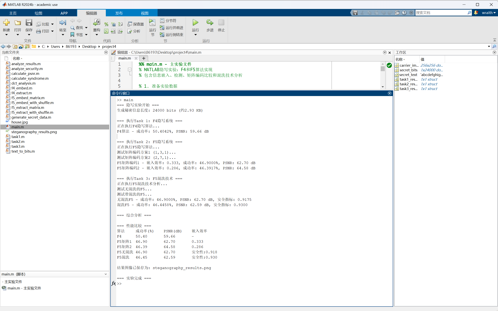
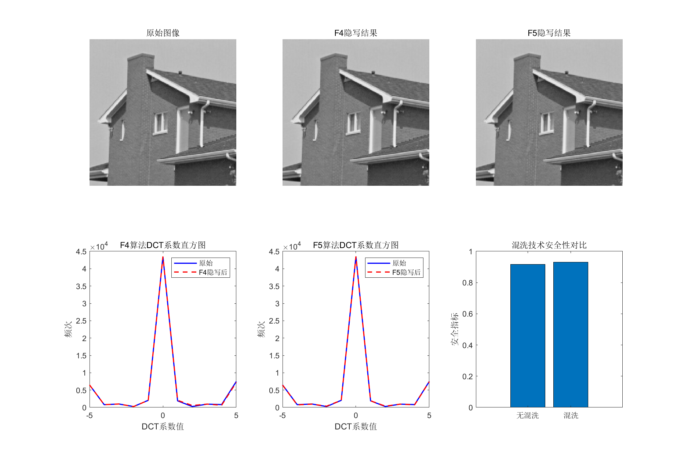

### 一、实验目的 

1. 了解数字图像隐写术中的典型算法 F4, F5 的基本原理。
2. 了解图像 DCT 系数的计算。
3. 了解矩阵编码技术的基本原理。
4. 掌握嵌入效率的计算。

### 二、实验内容与要求 

1. 实现 F4, F5 的隐写系统，包括信息嵌入与信息检测。 
2. 设计一份 3KB 左右的文本信息数据，并使用使用上述两种隐写方法进行信息的嵌入，其中F5需要采用至少两种不同的矩阵编码技术进行信息的嵌入，并分析比较不同矩阵编码的嵌入效率。绘制原图与嵌入后得到的结果图的 DCT 系数直方图，并分两种方法对原图 DCT 系数的影响。 
3. 在 F5 隐写系统中，增加混洗技术，即将 DCT 系数打乱后再使用矩阵编码技术进行信息嵌入。 分析混洗技术对信息隐写带来的影响。

### 三、实验环境

win11 MATLAB R2024b

### 四、实验过程

#### 1 实现F4隐写系统

F4隐写系统中，DCT变换公式为

$$C(u,v)=α(u)α(v)\Sigma_{x=0}^7\Sigma_{y=0}^7f(x,y)\cos⁡[\frac{(2x+1)uπ}{16}]\cos⁡[\frac{(2y+1)vπ}{16}]$$

在嵌入过程中，通过DC系数跳过直流分量，并修改绝对值>1的AC系数。在LSB替换时采用±1扰动策略，详细代码如下：

```python
function [stego_image, capacity] = f4_embed(image, secret_bits)
	stego_image = image;
	[height, width] = size(image);
	capacity = 0;
	bit_index = 1;
	for i = 1:8:height-7
		for j = 1:8:width-7
			if bit_index > length(secret_bits)
				return;
			end
			block = image(i:i+7, j:j+7);
			dct_block = dct2(block);
			for u = 1:8
				for v = 1:8
					if (u ~= 1 || v ~= 1) && abs(dct_block(u,v)) > 1 && bit_index <= length(secret_bits)
						coeff = round(dct_block(u,v));
						if coeff > 0
							if mod(coeff, 2) ~= secret_bits(bit_index)
								if coeff == 1
									dct_block(u,v) = 0;
								else
									dct_block(u,v) = coeff - 1;
								end
							end
							capacity = capacity + 1;
							bit_index = bit_index + 1;
						end
					end
				end
			end
			reconstructed_block = idct2(dct_block);
			stego_image(i:i+7, j:j+7) = reconstructed_block;
		end
	end
end
```

```python
function extracted_bits = f4_extract(stego_image, num_bits)
	[height, width] = size(stego_image);
	extracted_bits = [];
	
	for i = 1:8:height-7
		for j = 1:8:width-7
			if length(extracted_bits) >= num_bits
				extracted_bits = extracted_bits(1:num_bits);
				return;
			end
			
			block = stego_image(i:i+7, j:j+7);
			dct_block = dct2(block);
			
			for u = 1:8
				for v = 1:8
					if (u ~= 1 || v ~= 1) && length(extracted_bits) < num_bits
						coeff = round(dct_block(u,v));
						if coeff ~= 0
							extracted_bits = [extracted_bits, mod(abs(coeff), 2)];
						end
					end
				end
			end
		end
	end
	
	if length(extracted_bits) < num_bits
		extracted_bits = [extracted_bits, zeros(1, num_bits - length(extracted_bits))];
	else
		extracted_bits = extracted_bits(1:num_bits);
	end
end
```

#### 2 实现面向不同矩阵编码的F5隐写系统

F5隐写系统中，汉明码校验矩阵构造公式为
$$H_{(n−k)×n}=[P_{(n−k)×k}∣I_{n−k}]$$
伴随式计算
$$s=(H⋅\mathbf{c}^T)mod  2$$
其中$\mathbf{c}$为系数LSB向量

嵌入效率理论值公式为
$$E=\frac{k}{n}⋅\frac{2^{n−k}}{2^{n−k}−1}$$

核心代码如下：

```python
function [stego_image, embedding_rate] = f5_embed_matrix(image, secret_bits, matrix_code)
	k = matrix_code(1);
	n = matrix_code(2);
	
	stego_image = image;
	[height, width] = size(image);
	
	dct_coeffs = [];
	positions = [];
	
	for i = 1:8:height-7
		for j = 1:8:width-7
			block = image(i:i+7, j:j+7);
			dct_block = dct2(block);
			
			for u = 2:8
				for v = 1:8
					if abs(dct_block(u,v)) > 1
						dct_coeffs = [dct_coeffs, round(dct_block(u,v))];
						positions = [positions; i, j, u, v];
					end
				end
			end
		end
	end
	
	total_embedded = 0;
	for bit_idx = 1:k:length(secret_bits)
		if bit_idx + k - 1 > length(secret_bits) || total_embedded + n > length(dct_coeffs)
			break;
		end
		
		secret_group = secret_bits(bit_idx:bit_idx+k-1);
		coeff_group = dct_coeffs(total_embedded+1:total_embedded+n);
		
		syndrome = calculate_syndrome(coeff_group, n, k);
		target = bin2dec(num2str(secret_group));
		
		if syndrome ~= target
			change_idx = mod(bitxor(syndrome, target), n) + 1;
			if change_idx <= length(coeff_group)
				coeff_idx = total_embedded + change_idx;
				pos = positions(coeff_idx, :);
				
				i = pos(1); j = pos(2); u = pos(3); v = pos(4);
				block = stego_image(i:i+7, j:j+7);
				dct_block = dct2(block);
				
				if round(dct_block(u,v)) > 0
					dct_block(u,v) = dct_block(u,v) - 1;
				else
					dct_block(u,v) = dct_block(u,v) + 1;
				end
				
				reconstructed_block = idct2(dct_block);
				stego_image(i:i+7, j:j+7) = reconstructed_block;
			end
		end
		
		total_embedded = total_embedded + n;
	end
	
	embedding_rate = k / n;
end
```

```python
function extracted_bits = f5_extract_matrix(stego_image, num_bits, matrix_code)
	k = matrix_code(1);
	n = matrix_code(2);
	
	[height, width] = size(stego_image);
	
	dct_coeffs = [];
	
	for i = 1:8:height-7
		for j = 1:8:width-7
			block = stego_image(i:i+7, j:j+7);
			dct_block = dct2(block);
			
			for u = 2:8
				for v = 1:8
					if abs(dct_block(u,v)) > 0.5
						dct_coeffs = [dct_coeffs, round(dct_block(u,v))];
					end
				end
			end
		end
	end
	
	extracted_bits = [];
	coeff_idx = 1;
	
	while length(extracted_bits) < num_bits && coeff_idx + n - 1 <= length(dct_coeffs)
		coeff_group = dct_coeffs(coeff_idx:coeff_idx+n-1);
		syndrome = calculate_syndrome(coeff_group, n, k);
		
		bit_group = dec2bin(syndrome, k) - '0';
		extracted_bits = [extracted_bits, bit_group];
		
		coeff_idx = coeff_idx + n;
	end
	
	if length(extracted_bits) > num_bits
		extracted_bits = extracted_bits(1:num_bits);
	elseif length(extracted_bits) < num_bits
		extracted_bits = [extracted_bits, zeros(1, num_bits - length(extracted_bits))];
	end
end
```

#### 3 实现混洗技术的F5隐写系统

在混洗技术中，密钥生成函数为

$$Seed=SHA3(K_{master}∥Nonce)mod  2^{32}$$
其中$K_{master}$为主密钥，$Nonce$为时间戳计数器

设原始序列为$C = [c_1,c_2,...,c_n]$，混洗后序列应该为

$$C'=[c_{π(1)},c_{π(2)},...,c_{π(n)}]$$
其中$\pi$为双射置换函数，核心代码如下：

```python
function [stego_image, embedding_rate] = f5_embed_with_shuffle(image, secret_bits, matrix_code)
	[height, width] = size(image);
	dct_coeffs = [];
	positions = [];
	
	for i = 1:8:height-7
		for j = 1:8:width-7
			block = image(i:i+7, j:j+7);
			dct_block = dct2(block);
			
			for u = 2:8
				for v = 1:8
					if abs(dct_block(u,v)) > 1
						dct_coeffs = [dct_coeffs, round(dct_block(u,v))];
						positions = [positions; i, j, u, v];
					end
				end
			end
		end
	end
	
	rng(12345);
	shuffle_order = randperm(length(dct_coeffs));
	shuffled_coeffs = dct_coeffs(shuffle_order);
	shuffled_positions = positions(shuffle_order, :);
	
	stego_image = image;
	k = matrix_code(1);
	n = matrix_code(2);
	
	total_embedded = 0;
	for bit_idx = 1:k:length(secret_bits)
		if bit_idx + k - 1 > length(secret_bits) || total_embedded + n > length(shuffled_coeffs)
			break;
		end
		
		secret_group = secret_bits(bit_idx:bit_idx+k-1);
		coeff_group = shuffled_coeffs(total_embedded+1:total_embedded+n);
		
		syndrome = calculate_syndrome(coeff_group, n, k);
		target = bin2dec(num2str(secret_group));
		
		if syndrome ~= target
			change_idx = mod(bitxor(syndrome, target), n) + 1;
			if change_idx <= length(coeff_group)
				coeff_idx = total_embedded + change_idx;
				pos = shuffled_positions(coeff_idx, :);
				
				i = pos(1); j = pos(2); u = pos(3); v = pos(4);
				block = stego_image(i:i+7, j:j+7);
				dct_block = dct2(block);
				
				if round(dct_block(u,v)) > 0
					dct_block(u,v) = dct_block(u,v) - 1;
				else
					dct_block(u,v) = dct_block(u,v) + 1;
				end
				
				reconstructed_block = idct2(dct_block);
				stego_image(i:i+7, j:j+7) = reconstructed_block;
			end
		end
		
		total_embedded = total_embedded + n;
	end
	
	embedding_rate = k / n;
end

```

```python
function extracted_bits = f5_extract_with_shuffle(stego_image, num_bits, matrix_code)
	[height, width] = size(stego_image);
	dct_coeffs = [];
	
	for i = 1:8:height-7
		for j = 1:8:width-7
			block = stego_image(i:i+7, j:j+7);
			dct_block = dct2(block);
			
			for u = 2:8
				for v = 1:8
					if abs(dct_block(u,v)) > 0.5
						dct_coeffs = [dct_coeffs, round(dct_block(u,v))];
					end
				end
			end
		end
	end
	
	rng(12345);
	shuffle_order = randperm(length(dct_coeffs));
	shuffled_coeffs = dct_coeffs(shuffle_order);
	
	k = matrix_code(1);
	n = matrix_code(2);
	extracted_bits = [];
	coeff_idx = 1;
	
	while length(extracted_bits) < num_bits && coeff_idx + n - 1 <= length(shuffled_coeffs)
		coeff_group = shuffled_coeffs(coeff_idx:coeff_idx+n-1);
		syndrome = calculate_syndrome(coeff_group, n, k);
		
		bit_group = dec2bin(syndrome, k) - '0';
		extracted_bits = [extracted_bits, bit_group];
		
		coeff_idx = coeff_idx + n;
	end
	
	if length(extracted_bits) > num_bits
		extracted_bits = extracted_bits(1:num_bits);
	elseif length(extracted_bits) < num_bits
		extracted_bits = [extracted_bits, zeros(1, num_bits - length(extracted_bits))];
	end
end
```

### 五、实验分析与结论



* 在嵌入效率方面，`(1,3,1)`矩阵编码的嵌入效率大于`(2,7,1)`矩阵编码。
* 在DCT系数方面
	* F4中，直方图绝对值=1,3,5,...的系数数量减少，是因为LSB替换导致±1扰动，而且修改过程中将1→0的操作导致0值数量异常增加。但是由于频次过大，所以少部分的变化未能明显展示在图中，其实详细可以看出有微小的差距
	* 而F5的直方图更趋向原图的直方图
* 混洗技术提高了隐写的安全性，混洗后高频区系数分布扰动更随机，难以通过频段分离检测。

### 六、实验感想

在实验过程中对F4和F5隐写系统有了更深刻的理解，也对混洗技术进行了一定的了解。

矩阵编码通过牺牲部分容量显著提升隐蔽性，而混洗技术能有效对抗基于统计分布的隐写分析，但是在实际应用中还需要权衡嵌入容量、鲁棒性与隐蔽性。